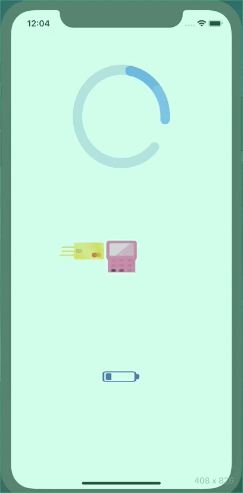

# Animations-Exercise
Exercise to test Lottie animations in Xcode

Lottie es una galería de animaciones que se pueden integrar fácilmente a nuestro proyecto de Xcode, podemos ver la galería en la siguiente dirección, descargamos el archivo Json que nos dan y lo integramos a nuestro proyecto de Xcode, para poder usar las animaciones deber descargar el Pod de Lottie usando Cocoa Pods, despues de tener el Pod instalado y el Json de cada animación en nuestro proyecto, con unas líneas de código se pueden reproducir las animaciones de forma sencilla.

https://lottiefiles.com/

En el siguiente gif se puede ver el resultado.

